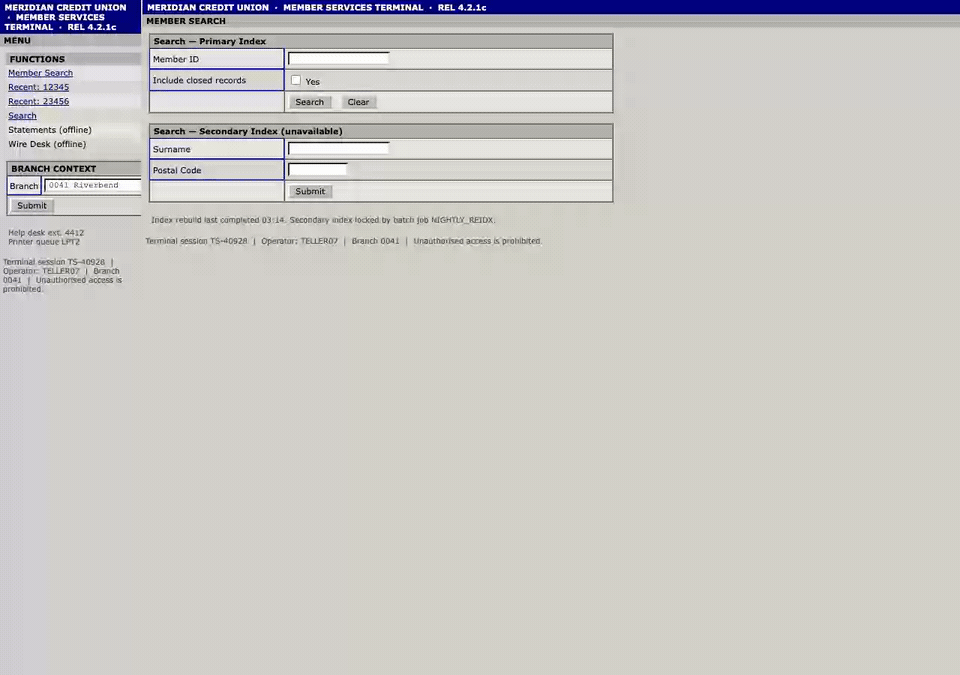

# Agentic Workflow Automation for Legacy Software Without APIs

Many business-critical applications have no usable API, stable selectors, or modern
frontend. This is true across industries, including healthcare, finance, accounting,
retail, insurance, government, manufacturing, and logistics. This project demonstrates
how an AI agent can move work through that software using a scoped browser capability built
with Playwright and Chromium.

The process starts with the employee's real workflow: its inputs, handoffs, decisions,
exceptions, expected outcome, and points where a person must stay in control. During
discovery, an AI model works through the same interface the employee uses. The successful
interaction is compiled into a draft capability for human review. Once approved, routine
execution replays deterministically without a model, making it faster, cheaper, auditable,
and easier to govern. When the capability cannot proceed safely, it hands the same live
session to a human operator.

The included test environment is **simulated legacy software** containing a synthetic
financial workflow. It is one concrete example, not an industry-specific product. The UI
contains generated data only and is not connected to any real organization, customer, or
production system. The architecture applies equally to comparable legacy workflows in
healthcare, finance, accounting, retail, insurance, government, manufacturing, logistics,
and other operational environments where an API is missing or insufficient.

## How a Forward-Deployed Team Would Use This

The starting point is the customer workflow, not the technology. A forward-deployed
engineer first works with employees to understand where work slows down, how decisions and
handoffs happen, which exceptions matter, what success looks like, and where human approval
is required. If the existing software has no usable API or MCP integration, Playwright and
Chromium provide the interface through which the discovery model can perform the task.

That successful run is then compiled into a reviewed, scoped browser capability. The model
is used to discover the workflow, but it does not remain in the execution path for routine
replay. This gives an agent a governed way to move work through the existing system, with
defined inputs, outcomes, approval points, and an audit trail instead of improvising every
time.

The intended production pattern is to run the browser worker inside the customer's
environment, keep sensitive actions behind human approval, and preserve an auditable record
of every run. An employee-facing agent could invoke the reviewed capability through email,
Teams, or another workflow system. This repository implements the discovery, approval,
replay, evidence, and human-handoff layers; those channel and production-deployment
integrations are deliberately outside the prototype's scope.

## See It Work



In this real discovery run, `ollama/gemma4:31b-cloud` observes the simulated legacy software and
chooses `type -> click -> read -> done`. The compiler then produces a draft capability.
After human approval, the same workflow can run repeatedly without a model.
[Watch the MP4](docs/ai-discovery-demo.mp4).

The presentation edit adds cursor motion and colored target emphasis for readability. The
underlying browser actions and result come from the real model-driven discovery run.

```text
goal -> discovery model -> draft artifact -> human approval -> deterministic replay
              |                                      |
              +-> evidence                           +-> typed result or handoff
```

## Setup

Requires Python 3.11+.

```bash
python3 -m pip install -r requirements.txt
python3 -m playwright install chromium
```

For a reproducible environment, install `requirements.lock` instead. Start the synthetic
target in one terminal:

```bash
python3 mock_bank/server.py
curl -s http://127.0.0.1:8099/health
```

The simulated application deliberately uses framesets, table layout, duplicate labels, and
no test IDs or ARIA annotations. These reproduce common constraints in older enterprise
software. All member records and balances are generated test data: `12345` and `23456`
return different balances, `99999` is denied, and unknown IDs return a business outcome.

## Model Privacy

Ollama with `qwen3:8b` at a loopback host is the default. This is the only configuration
treated as local inference:

```bash
ollama serve
ollama pull qwen3:8b
```

Hosted Ollama tags such as `gemma4:31b-cloud`, non-loopback Ollama hosts, OpenAI, and
Anthropic are remote. Discovery refuses them unless `--allow-remote-model` is supplied.
That flag is explicit consent to send observed UI state to the configured provider.

```bash
export OPENAI_API_KEY=...  # bring your own key; never commit it
python3 -m capability_system.cli discover ... \
  --provider openai --model gpt-4o-mini --allow-remote-model
```

Replay has no provider option and imports no model client.

## Demo

Run discovery against synthetic data:

```bash
python3 -m capability_system.cli discover \
  --goal "Look up a member and read their current savings balance" \
  --url http://127.0.0.1:8099/app \
  --id lookup_member_balance \
  --product mock-core-banking \
  --input member_id=12345 \
  --sensitive member_id \
  --synthetic-evidence
```

Add `--record-video recordings/` to save a WebM recording of any discovery or replay.

`--synthetic-evidence` permits full observations, screenshots, and failure page source. It
must only be used with generated test data. Without it, dynamic content is minimized and
screenshots/page source are not persisted.

Discovery writes a draft to `capabilities/` and a run directory under `evidence/`. Review
the artifact, then approve it as a separate human action:

```bash
python3 -m capability_system.cli approve --id lookup_member_balance
```

Replay the same artifact with multiple inputs:

```bash
python3 -m capability_system.cli replay \
  --id lookup_member_balance --input member_id=12345 --synthetic-evidence

python3 -m capability_system.cli replay \
  --id lookup_member_balance --input member_id=23456 --synthetic-evidence

python3 -m capability_system.cli replay \
  --id lookup_member_balance --input member_id=00000 --synthetic-evidence
```

The first two return different balances through the same structural target. The last exits
successfully with `MEMBER_NOT_FOUND`: a valid business result is not an automation failure.

Exercise recovery and hard-failure paths:

```bash
curl -s http://127.0.0.1:8099/control/fault/interstitial
python3 -m capability_system.cli replay --id lookup_member_balance \
  --input member_id=12345 --synthetic-evidence

curl -s http://127.0.0.1:8099/control/fault/servererror
python3 -m capability_system.cli replay --id lookup_member_balance \
  --input member_id=12345 --synthetic-evidence

curl -s http://127.0.0.1:8099/control/fault/clear
```

Run the end-to-end handoff demo while the mock target is running:

```bash
python3 scripts/demo_escalation.py --headed
```

The file-backed broker is intentionally a stand-in for an operator console. The session
lease, pause, intervention record, operator disposition, operator-supplied output, fresh
observation on reclaim, and prevention of duplicate irreversible actions are real.

## Safety Properties

- Discovery emits `draft`; only the `approve` command promotes an artifact.
- Every action passes through action, origin, path, frame-origin, and risk policy checks.
- Remote model use requires explicit consent.
- Content-derived table cells compile only to value-free structural targets.
- Inputs and required outputs are validated at runtime.
- Recovery is bounded per rule and step, with an absolute re-entry ceiling.
- Real-data evidence omits screenshots, page source, values, and content-derived labels by
  default. Declared sensitive values are redacted at every write boundary.
- Replay returns `success`, `business_outcome`, `escalated`, or a typed `hard_failure`.

## Tests

```bash
python3 -m pytest -q
```

The suite combines fast executor/evidence unit tests with Chromium integration tests
against the real mock application. It verifies cross-origin frame blocking, exact path
prefix boundaries, remote-provider classification, output contracts, privacy-safe evidence,
structural target generalization, recovery ceilings, and handoff behavior.

Run a repository secret scan before publishing:

```bash
gitleaks dir . --no-banner --redact
```

## Layout

```text
capability_system/
  artifact/       typed, versioned capability contract
  discovery/      provider adapters and observe/decide/act compiler
  perception/     portable surface protocol and Playwright implementation
  replay/         deterministic executor, conditions, typed outcomes
  safety/         policy and redaction
  escalation/     session lease, intervention broker, handoff records
  evidence/       append-only, privacy-aware run recorder
capabilities/     reviewed capability artifacts
evidence/         ten curated synthetic runs and their index
mock_bank/        simulated legacy software fixture with a synthetic financial workflow
scripts/          end-to-end handoff demo
tests/            unit and browser integration tests
```

See `REPORT.md` for the design rationale and `SECURITY.md` for disclosure and deployment
boundaries.
